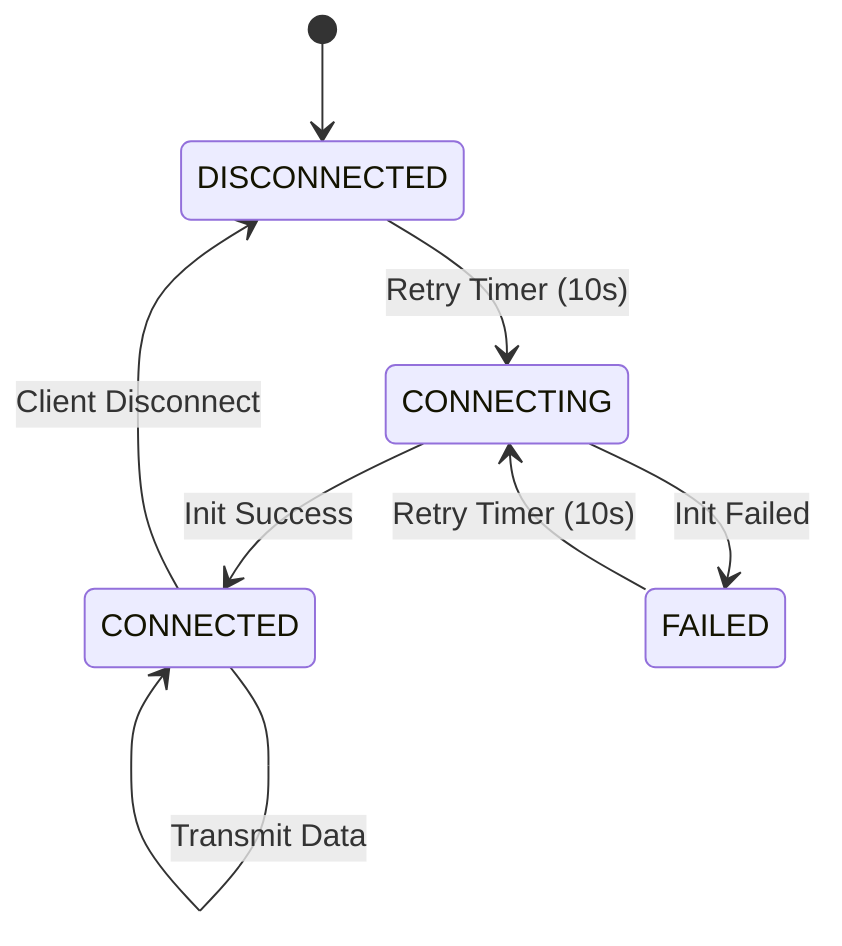

# BLE Resilience Plan: Device Operation Without BLE

## Objective
Make the M5Core2 XCTrack variometer fully functional without BLE connectivity, while continuously retrying BLE connections at a fixed 10-second interval when BLE is unavailable.

## Current Problems

### 1. **Hard Dependency on BLE**
- [`ble_uart_init()`](../src/ble_uart.cpp:73) is called once and doesn't return status
- No error handling if BLE initialization fails
- [`ble_task()`](../src/ble_uart.cpp:41) assumes BLE is always available
- Device may hang or crash if BLE component fails

### 2. **No Retry Mechanism**
- BLE initialization happens only once at startup
- If initialization fails, no recovery attempt is made
- No periodic reconnection attempts

### 3. **No Connection State Awareness**
- System doesn't know if BLE is connected, disconnected, or failed
- [`ble_uart_transmit_LK8EX1()`](../src/ble_uart.cpp:107) transmits blindly
- No way to display connection status to user

## Design Solution

### Architecture Overview



### Component Changes

#### 1. BLE State Management

**New Connection State Enum** (in [`ble_uart.h`](../src/ble_uart.h)):
```cpp
enum BLEConnectionState {
    BLE_DISCONNECTED,  // Not initialized or disconnected
    BLE_CONNECTING,    // Attempting initialization
    BLE_CONNECTED,     // Successfully connected and advertising
    BLE_FAILED         // Last initialization attempt failed
};
```

**State Variables**:
- `BLEConnectionState bleState` - Current connection state
- `SemaphoreHandle_t xBLEStateMutex` - Protects state variable
- `uint32_t bleRetryCount` - Tracks retry attempts (for logging)

#### 2. Modified BLE Initialization

**Current Signature**:
```cpp
void ble_uart_init();
```

**New Signature**:
```cpp
bool ble_uart_init();  // Returns true on success, false on failure
```

**Error Handling Strategy**:
- Wrap BLE initialization in try-catch or check return values
- Log failures without halting execution
- Return status to caller for decision making

**Implementation**:
```cpp
bool ble_uart_init() {
    try {
        ESP_LOGI("ble_uart.cpp", "Starting BLE initialization");
        BLEDevice::init("M5Core2-Vario");
        BLEDevice::setMTU(46);
        BLEDevice::setPower(ESP_PWR_LVL_N0);
        
        pBLEServer = BLEDevice::createServer();
        if (!pBLEServer) {
            ESP_LOGE("ble_uart.cpp", "Failed to create BLE server");
            return false;
        }
        
        pBLEServer->setCallbacks(new MyServerCallbacks());
        pService = pBLEServer->createService(SERVICE_UUID);
        // ... rest of initialization
        
        pService->start();
        pBLEServer->getAdvertising()->start();
        ESP_LOGI("ble_uart.cpp", "BLE advertising started successfully");
        return true;
    } catch (const std::exception& e) {
        ESP_LOGE("ble_uart.cpp", "BLE initialization failed: %s", e.what());
        return false;
    }
}
```

#### 3. Enhanced BLE Task Loop

**New Task Logic**:

```cpp
void ble_task(void *pvParameter) {
    (void) pvParameter;
    
    int32_t altitudeM = 0;
    int32_t climbrateCps = 0;
    int32_t prevBatLevel = 0;
    uint32_t lastRetryAttempt = 0;
    
    // Initialize state mutex
    xBLEStateMutex = xSemaphoreCreateMutex();
    setBLEState(BLE_DISCONNECTED);
    
    while (1) {
        BLEConnectionState currentState = getBLEState();
        
        switch (currentState) {
            case BLE_DISCONNECTED:
            case BLE_FAILED:
                // Check if retry interval has elapsed
                if (millis() - lastRetryAttempt >= BLE_RETRY_INTERVAL_MS) {
                    ESP_LOGI("ble_uart.cpp", "Attempting BLE connection...");
                    setBLEState(BLE_CONNECTING);
                    lastRetryAttempt = millis();
                    
                    if (ble_uart_init()) {
                        setBLEState(BLE_CONNECTED);
                        ESP_LOGI("ble_uart.cpp", "BLE connected successfully");
                    } else {
                        setBLEState(BLE_FAILED);
                        ESP_LOGW("ble_uart.cpp", "BLE connection failed, will retry in %d seconds", 
                                 BLE_RETRY_INTERVAL_MS / 1000);
                    }
                }
                break;
                
            case BLE_CONNECTED:
                // Read variometer data
                if (xSemaphoreTake(xVariometerMutex, (TickType_t)10) == pdTRUE) {
                    altitudeM = static_cast<int32_t>(globalAltitude_m);
                    climbrateCps = static_cast<int32_t>(globalVerticalSpeed_mps * 100);
                    xSemaphoreGive(xVariometerMutex);
                }
                
                // Read battery data
                int32_t batLevel = M5.Power.getBatteryLevel();
                batLevel = (batLevel > 0) ? (batLevel / 1000.0f) : prevBatLevel;
                if (batLevel > 0) {
                    prevBatLevel = batLevel;
                }
                
                // Transmit only when connected
                ble_uart_transmit_LK8EX1(altitudeM, climbrateCps, batLevel);
                break;
                
            case BLE_CONNECTING:
                // Wait for initialization to complete
                break;
        }
        
        vTaskDelay(100 / portTICK_PERIOD_MS);
    }
}
```

#### 4. Thread-Safe State Access Functions

```cpp
void setBLEState(BLEConnectionState newState) {
    if (xSemaphoreTake(xBLEStateMutex, portMAX_DELAY) == pdTRUE) {
        bleState = newState;
        xSemaphoreGive(xBLEStateMutex);
    }
}

BLEConnectionState getBLEState() {
    BLEConnectionState state = BLE_DISCONNECTED;
    if (xSemaphoreTake(xBLEStateMutex, (TickType_t)10) == pdTRUE) {
        state = bleState;
        xSemaphoreGive(xBLEStateMutex);
    }
    return state;
}
```

#### 5. Enhanced Server Callbacks

```cpp
class MyServerCallbacks : public BLEServerCallbacks {
    void onConnect(BLEServer* pServer) {
        ESP_LOGI("ble_uart.cpp", "BLE client connected");
        setBLEState(BLE_CONNECTED);
    }
    
    void onDisconnect(BLEServer* pServer) {
        ESP_LOGI("ble_uart.cpp", "BLE client disconnected");
        setBLEState(BLE_DISCONNECTED);
        pServer->getAdvertising()->start(); // Restart advertising
    }
};
```

#### 6. Configuration Constants

**Add to [`config.h`](../src/config.h)**:
```cpp
// BLE Configuration
const uint32_t BLE_RETRY_INTERVAL_MS = 10000;  // 10 seconds retry interval
const bool BLE_SHOW_STATUS_ON_DISPLAY = true;  // Show BLE status indicator
```

### Optional Enhancement: Display BLE Status

Add a small BLE indicator to the display header:

**Modified [`drawHeader()`](../src/main.cpp:233) function**:
```cpp
void drawHeader(int32_t battery, float altitude, BLEConnectionState bleState) {
    // ... existing header code ...
    
    // Draw BLE status icon (small indicator)
    lcd.setTextSize(1);
    if (bleState == BLE_CONNECTED) {
        lcd.setTextColor(TFT_GREEN, HEADER_BG_COLOR);
        lcd.setCursor(DISPLAY_WIDTH - 40, 5);
        lcd.print("BLE");
    } else if (bleState == BLE_CONNECTING) {
        lcd.setTextColor(TFT_YELLOW, HEADER_BG_COLOR);
        lcd.setCursor(DISPLAY_WIDTH - 40, 5);
        lcd.print("BLE");
    } else {
        lcd.setTextColor(TFT_RED, HEADER_BG_COLOR);
        lcd.setCursor(DISPLAY_WIDTH - 40, 5);
        lcd.print("---");
    }
}
```

## Implementation Steps

### Phase 1: Core State Management
1. Add BLE state enum to [`ble_uart.h`](../src/ble_uart.h)
2. Add state variables and mutex declarations
3. Implement `setBLEState()` and `getBLEState()` helper functions
4. Update [`config.h`](../src/config.h) with BLE retry interval constant

### Phase 2: BLE Initialization Changes
5. Change [`ble_uart_init()`](../src/ble_uart.cpp:73) return type from void to bool
6. Add error handling and return status codes
7. Test initialization with deliberate failures

### Phase 3: Task Loop Refactoring
8. Rewrite [`ble_task()`](../src/ble_uart.cpp:41) with state machine logic
9. Add retry timer logic
10. Implement conditional transmission (only when CONNECTED)
11. Update server callbacks to set connection state

### Phase 4: Display Integration (Optional)
12. Modify [`drawHeader()`](../src/main.cpp:233) to accept BLE state parameter
13. Add BLE status indicator to display
14. Export `getBLEState()` for main loop access

### Phase 5: Testing & Validation
15. Test device operation with BLE disabled
16. Verify retry mechanism works at 10-second intervals
17. Test reconnection after deliberate disconnect
18. Verify all other tasks continue normally without BLE

## Benefits

### ✅ **Graceful Degradation**
- Device operates normally without BLE
- Sensor readings, display, and sound continue working
- No crashes or hangs from BLE failures

### ✅ **Automatic Recovery**
- Continuous retry attempts every 10 seconds
- Reconnects automatically when BLE becomes available
- No manual intervention required

### ✅ **User Awareness**
- Optional display indicator shows BLE status
- Clear logging of connection state changes
- User knows when XCTrack integration is active

### ✅ **Robustness**
- Thread-safe state management
- Proper error handling
- Follows FreeRTOS best practices

## Risk Mitigation

### Potential Issues

1. **Memory Leaks on Retry**
   - **Risk**: Repeated initialization attempts may leak memory
   - **Mitigation**: Properly cleanup/deinitialize BLE before retry attempts
   - **Implementation**: Add `ble_uart_deinit()` function if needed

2. **Mutex Deadlocks**
   - **Risk**: Multiple mutexes could cause deadlocks
   - **Mitigation**: Use timeouts on all mutex acquisitions
   - **Implementation**: Already using `(TickType_t)10` timeouts

3. **Task Timing Impact**
   - **Risk**: Retry attempts might delay other operations
   - **Mitigation**: Initialization happens in dedicated task
   - **Implementation**: BLE task has lowest priority (1)

## Testing Strategy

### Unit Tests
- Test state transitions (DISCONNECTED → CONNECTING → CONNECTED)
- Test retry timer accuracy
- Test mutex protection of shared state

### Integration Tests
- Disable BLE and verify device operates normally
- Enable BLE and verify connection succeeds
- Disconnect client and verify auto-reconnection
- Run for extended period (4+ hours) to check stability

### Field Tests
- Test in actual flight conditions
- Verify XCTrack receives data after reconnection
- Monitor power consumption impact

## Success Criteria

1. ✅ Device boots and operates without BLE available
2. ✅ All sensors, display, and sound work without BLE
3. ✅ BLE retries every 10 seconds when disconnected
4. ✅ Successful reconnection within 10 seconds of BLE availability
5. ✅ No crashes or hangs from BLE failures
6. ✅ Clear logging of connection status
7. ✅ (Optional) Display shows BLE connection status

## Files to Modify

1. [`src/ble_uart.h`](../src/ble_uart.h) - Add state enum and function declarations
2. [`src/ble_uart.cpp`](../src/ble_uart.cpp) - Implement state machine and retry logic
3. [`src/config.h`](../src/config.h) - Add BLE configuration constants
4. [`src/main.cpp`](../src/main.cpp) - Optional display integration

## Next Steps

Once this plan is approved:
1. Switch to Code mode for implementation
2. Follow the implementation steps in order
3. Test each phase before proceeding
4. Document any deviations from the plan
