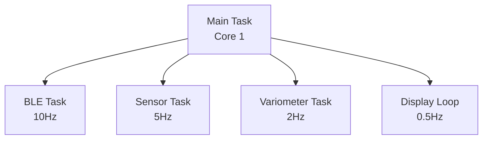
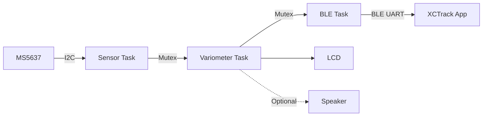

# System Architecture

## Overview
Real-time embedded system on ESP32-based M5Stack Core2 using FreeRTOS multi-task architecture for sensor acquisition, processing, and wireless transmission.

## Hardware Architecture
- **MCU**: ESP32 (dual-core, 240MHz)
- **Sensor**: MS5637 barometric (I2C)
- **Display**: 320x240 TFT LCD
- **Audio**: Built-in speaker
- **Communication**: BLE UART
- **Power**: Battery with monitoring

## Task Architecture

## Data Flow

## Synchronization
- **Mutexes**: xSensorMutex, xVariometerMutex
- **Task Stacks**: Sensor/Variometer: 8KB, BLE: 4KB
- **Shared Data**: Altitude, V-speed, pressure, temperature

## Initialization Sequence
1. M5Stack hardware initialization
2. Sensor I2C setup and validation
3. Variometer filter initialization
4. BLE service advertising
5. Task creation and startup display

## Error Handling
- **Sensor init failure**: Log error and halt
- **Mutex timeout**: Log error and continue
- **BLE disconnect**: Auto-restart advertising

## Configuration
All constants defined in [`config.h`](../src/config.h) for easy tuning.

See [`component_specs.md`](component_specs.md) for implementation details.