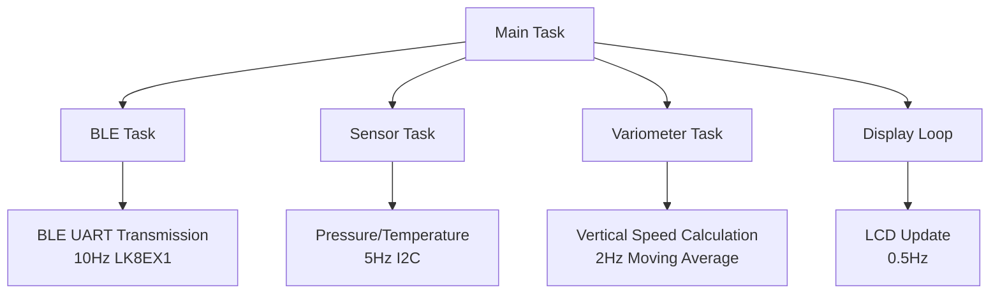
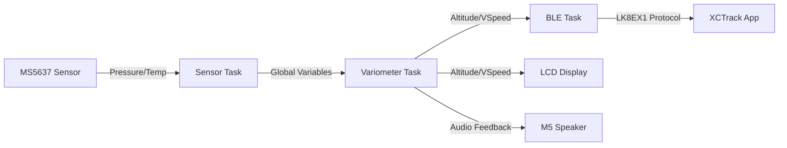

# System Architecture

## Overview
The M5Core2 XCTrack variometer is a real-time embedded system running on ESP32-based M5Stack Core2 hardware. It implements a multi-task FreeRTOS architecture with Arduino framework integration for sensor data acquisition, processing, and wireless transmission.

## Hardware Architecture
- **Microcontroller**: ESP32 (dual-core, 240MHz)
- **Sensors**: MS5637 barometric pressure/temperature sensor (I2C)
- **Communication**: BLE UART for XCTrack integration
- **Display**: 320x240 TFT LCD
- **Audio**: Built-in speaker for variometer tones
- **Power**: Battery monitoring via M5Unified

## Software Architecture

### Task Structure
The system uses FreeRTOS tasks running on separate cores for concurrent processing:

### Data Flow

### Memory Management
- **Global Variables**: Shared data protected by mutexes (xSensorMutex, xVariometerMutex)
- **Task Stacks**: Configured per task (Sensor: 8192, Variometer: 8192, BLE: 4096)
- **Buffers**: Altitude filter uses std::vector with 10 samples

### Communication Protocols
- **I2C**: 400kHz for MS5637 sensor
- **BLE**: UART service with custom UUIDs, MTU 46 bytes
- **NMEA**: LK8EX1 sentence format with XOR checksum

### Initialization Sequence
1. M5Stack hardware initialization
2. Sensor I2C setup and validation
3. Variometer buffer initialization
4. BLE service setup and advertising
5. Task creation and startup screen display

### Error Handling
- Sensor initialization failure: Infinite loop with error log
- Mutex timeouts: Logged errors, continue operation
- BLE disconnect: Automatic advertising restart

### Configuration
All constants defined in `config.h` for easy tuning:
- Update rates and thresholds
- Audio parameters
- Hardware pin assignments
- Task stack sizes