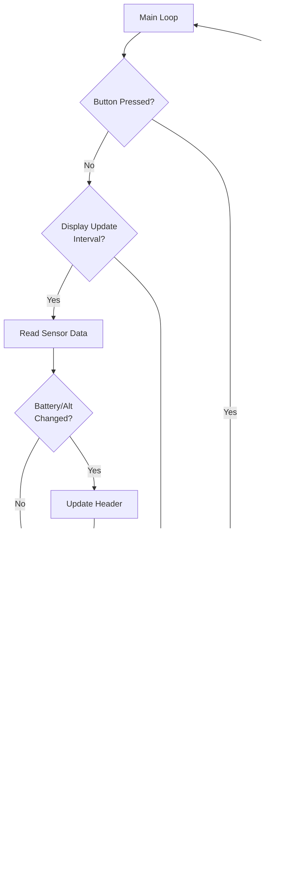

# Display Redesign Specification

## Overview
Complete redesign of the M5Stack Core2 display to prioritize vertical speed visibility for paragliding, with battery and altitude information in a compact header.

## Display Specifications
- **Screen Resolution**: 320x240 pixels (M5Stack Core2)
- **Update Rate**: 500ms (2 Hz) - doubled from current 1Hz
- **Orientation**: Landscape (320 wide x 240 high)

## Layout Design

### Three-Zone Layout

```
┌─────────────────────────────────────┐
│ HEADER (40px height)                │
│ Battery: 3.8V    Alt: 1234.5m       │
├─────────────────────────────────────┤
│                                     │
│         MAIN DISPLAY                │
│                                     │
│          +2.5 m/s                   │
│                                     │
│        (170px height)               │
│                                     │
├─────────────────────────────────────┤
│ FOOTER (30px height)                │
│ [🔊] Sound: ON                      │
└─────────────────────────────────────┘
```

### Zone Specifications

#### Header Bar (Top 40 pixels)
- **Background**: Dark gray/blue (#1a1a2e)
- **Height**: 40 pixels
- **Layout**: Two columns
  - **Left**: Battery voltage (e.g., "Bat: 3.8V")
  - **Right**: Altitude (e.g., "Alt: 1234.5m")
- **Font Size**: 2 (medium)
- **Text Color**: White (#FFFFFF)
- **Alignment**: Left for battery, Right for altitude

#### Main Display Area (Middle 170 pixels)
- **Background**: Black (#000000)
- **Height**: 170 pixels (y: 40-210)
- **Content**: Vertical speed value with sign and units
- **Font Size**: 8-10 (very large, needs testing)
- **Format**: "+2.5 m/s" or "-1.2 m/s"
- **Sign**: Always show "+" or "-"
- **Alignment**: Center (both horizontal and vertical)
- **Color Coding**:
  - **Green** (#00FF00): Climbing (vSpeed > +0.3 m/s)
  - **Red** (#FF0000): Sinking (vSpeed < -0.3 m/s)
  - **Yellow** (#FFFF00): Neutral (-0.3 ≤ vSpeed ≤ +0.3 m/s)

#### Footer Bar (Bottom 30 pixels)
- **Background**: Dark gray (#2a2a3e)
- **Height**: 30 pixels (y: 210-240)
- **Content**: Sound status indicator
- **Layout**: Left-aligned icon + text
  - Icon area: 30x30 pixels (simple speaker symbol)
  - Text: "ON" or "MUTED"
- **Font Size**: 1-2 (small to medium)
- **Colors**:
  - Icon: White when ON, Gray (#808080) when MUTED
  - Text: White when ON, Gray when MUTED

## Display Update Strategy

### Anti-Flicker Optimization
Instead of full screen clear (`lcd.fillScreen()`), use selective updates:

1. **Header Zone**: Update only when values change significantly
   - Battery: Update when voltage changes by ±0.1V
   - Altitude: Update when altitude changes by ±1.0m

2. **Main Display**: Update every cycle but use:
   - Clear only the text area (calculated bounds)
   - Use `fillRect()` for targeted clearing
   - Immediately redraw new value

3. **Footer Zone**: Update only on sound status change
   - Toggle triggered by button press

### Update Pseudo-code
```cpp
// Only clear and redraw if value changed significantly
if (abs(newValue - oldValue) > threshold) {
    lcd.fillRect(x, y, width, height, backgroundColor);
    lcd.drawString(newText, x, y);
    oldValue = newValue;
}
```

## Color Scheme Constants

### Primary Colors (TFT standard)
- `TFT_BLACK` (0x0000) - Main background
- `TFT_WHITE` (0xFFFF) - Default text
- `TFT_GREEN` (0x07E0) - Climbing indicator
- `TFT_RED` (0xF800) - Sinking indicator
- `TFT_YELLOW` (0xFFE0) - Neutral indicator

### Custom Colors (RGB565 format)
- `HEADER_BG` (0x1A0E) - Header background (dark blue-gray)
- `FOOTER_BG` (0x2A2E) - Footer background (dark gray)
- `MUTED_GRAY` (0x8410) - Muted status color

## Touch Button Integration

### Left Button Function
- **Purpose**: Toggle sound ON/MUTE
- **Detection**: M5.BtnA.wasPressed() in main loop
- **Action**: 
  1. Toggle `globalSoundEnabled` variable
  2. Update footer display immediately
  3. Log state change

### Implementation Notes
- Already have `globalSoundEnabled` in main.cpp
- Need to add touch detection in main loop
- Footer updates on toggle only (not every cycle)

## Configuration Constants (config.h additions)

```cpp
// Display Layout Constants
const int DISPLAY_UPDATE_INTERVAL_MS = 500; // 2 Hz update rate
const int HEADER_HEIGHT = 40;
const int FOOTER_HEIGHT = 30;
const int MAIN_DISPLAY_HEIGHT = 170;

// Vertical Speed Thresholds
const float VSPEED_CLIMB_THRESHOLD = 0.3;   // m/s
const float VSPEED_SINK_THRESHOLD = -0.3;   // m/s

// Display Colors (RGB565)
const uint16_t HEADER_BG_COLOR = 0x1A0E;
const uint16_t FOOTER_BG_COLOR = 0x2A2E;
const uint16_t MUTED_GRAY_COLOR = 0x8410;

// Update Thresholds (to prevent flicker)
const float ALTITUDE_UPDATE_THRESHOLD = 1.0;  // meters
const float BATTERY_UPDATE_THRESHOLD = 0.1;   // volts
const float VSPEED_UPDATE_THRESHOLD = 0.05;   // m/s

// Text Sizes
const int HEADER_TEXT_SIZE = 2;
const int MAIN_TEXT_SIZE = 10;  // May need adjustment based on testing
const int FOOTER_TEXT_SIZE = 2;
```

## Implementation Approach

### New Display Functions

1. **`drawHeader(float battery, float altitude)`**
   - Clear header area if needed
   - Draw battery voltage (left aligned)
   - Draw altitude (right aligned)
   - Store previous values for change detection

2. **`drawMainDisplay(float vSpeed)`**
   - Determine color based on thresholds
   - Calculate text bounds
   - Clear previous text area
   - Draw new vertical speed value (large, centered)
   - Format: "+X.X m/s" or "-X.X m/s"

3. **`drawFooter(bool soundEnabled)`**
   - Draw speaker icon (simple geometric shape)
   - Draw status text ("ON" or "MUTED")
   - Apply appropriate colors

4. **`updateDisplay()`**
   - Main orchestration function
   - Calls sub-functions with change detection
   - Manages update timing

### Modified loop() Function

```cpp
void loop() {
    static unsigned long lastDisplayUpdate = 0;
    static float prevBattery = 0;
    static float prevAltitude = 0;
    static float prevVSpeed = 0;
    static bool prevSoundEnabled = true;
    
    unsigned long currentMillis = millis();
    
    // Check for button press (sound toggle)
    M5.update();
    if (M5.BtnA.wasPressed()) {
        globalSoundEnabled = !globalSoundEnabled;
        drawFooter(globalSoundEnabled);
    }
    
    // Display update (500ms interval)
    if (currentMillis - lastDisplayUpdate >= DISPLAY_UPDATE_INTERVAL_MS) {
        // Read sensor data (with mutex protection)
        float battery = M5.Power.getBatteryVoltage();
        float altitude = globalAltitude_m;
        float vSpeed = globalVerticalSpeed_mps;
        
        // Update header if changed significantly
        if (abs(battery - prevBattery) >= BATTERY_UPDATE_THRESHOLD ||
            abs(altitude - prevAltitude) >= ALTITUDE_UPDATE_THRESHOLD) {
            drawHeader(battery, altitude);
            prevBattery = battery;
            prevAltitude = altitude;
        }
        
        // Update main display if changed
        if (abs(vSpeed - prevVSpeed) >= VSPEED_UPDATE_THRESHOLD) {
            drawMainDisplay(vSpeed);
            prevVSpeed = vSpeed;
        }
        
        lastDisplayUpdate = currentMillis;
    }
    
    vTaskDelay(pdMS_TO_TICKS(50)); // Check buttons frequently
}
```

## Testing Checklist

- [ ] Verify text sizes are readable at arm's length
- [ ] Confirm color thresholds match user expectations
- [ ] Test display updates don't cause visible flicker
- [ ] Validate 500ms update rate performance
- [ ] Test button press responsiveness
- [ ] Verify battery and altitude precision display correctly
- [ ] Test extreme values (large numbers, negative values)
- [ ] Check display in bright sunlight (if possible)
- [ ] Verify thread-safe data access in new loop structure
- [ ] Confirm sound toggle works reliably

## Mermaid Diagram: Display Update Flow



## File Changes Summary

### Files to Modify
1. **`src/config.h`** - Add display configuration constants
2. **`src/main.cpp`** - Implement new display functions and update loop()

### Files to Create
- None (all changes in existing files)

## Dependencies
- M5GFX library (already included)
- M5Unified library (already included)
- No additional libraries required

## Backwards Compatibility
- Maintains all existing functionality (BLE, sensors, variometer)
- Only changes visual presentation
- Sound toggle adds new user interaction (non-breaking)

## Performance Considerations
- Faster update rate (500ms vs 1000ms) increases CPU usage slightly
- Selective updates reduce LCD operations
- Button polling at 50ms is responsive without excessive overhead
- No impact on sensor or BLE tasks (different cores)

## Future Enhancements (Out of Scope)
- Graphical vertical speed history chart
- GPS coordinate display
- Flight time counter
- Max altitude tracking
- Configuration menu via touch interface